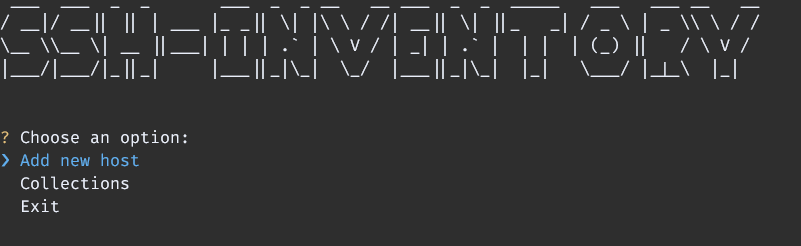
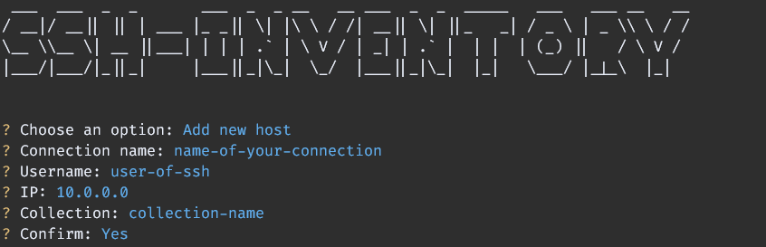
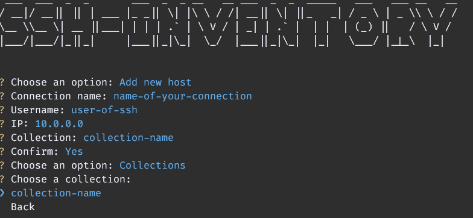
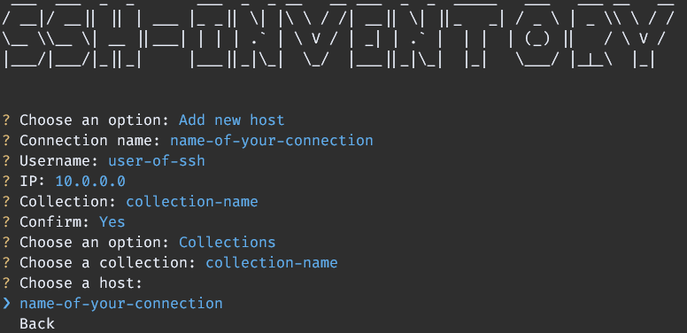
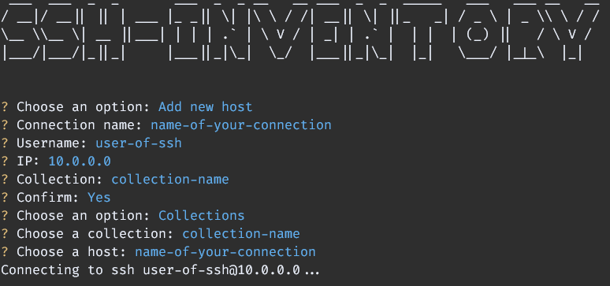

### SSH INVENTORY

Console application to inventory SSH sessions without using PuTTY or Moba or another one.

#### Requirements

- Python
- Powershell

#### Installation

Clone the repo

```bash
git clone git@github.com:MoreiraCristiano/ssh-inventory.git
```

Install [pipenv](https://pipenv.pypa.io/en/latest/)

```bash
pip install pipenv
```

Install deps

```bash
# Will download all deps from Pipfile
pipenv install
```

#### Basic usage

**Main Menu:** Here you select your next action or exit



**Add new host:** Here you can add a new connection host



**Collections:** Here you will select the collection/folder with your ssh connections



**Choose a host:** Finally choose the host to connect



When you hits enter the connection will occurs


